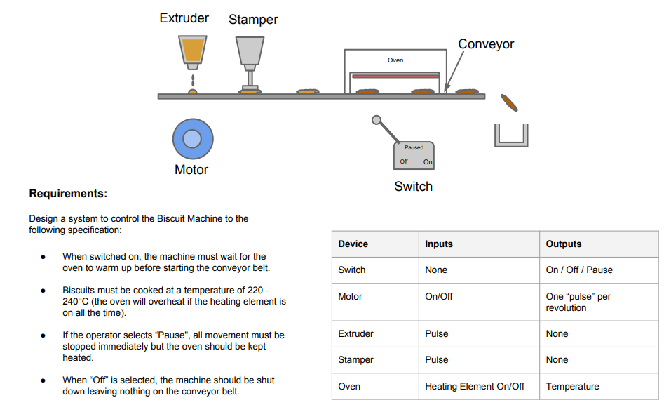

# React based 'Biscuit Machine'

This project was bootstrapped with [Create React App](https://github.com/facebook/create-react-app).

## Visual guidance:

 - Biscuits have 4 possible states : 1. from extruder to stamper 2. from stamper to oven. 3. from oven to basket. 4. out of conveyer ( in basket )
 - Baked biscuits in basket are being updated constantly and their count appears if > 0
 - Biscuits on conveyer ( including baked ones not in the basket ) could be considered as waste and on 'Stop' you can see their count

## Tech Prerequisites

Make sure that you have Node.js v12.18.4 and npm v6.14.6 or above installed.

## Usage

In the project directory, you can install `node_modules` and start the dev server with:

### `npm i`
### `yarn start`

The app will start in development mode.
Open [http://localhost:3000](http://localhost:3000) to view it in the browser.

## Testing

[TODO] I plan to add unit tests with Jest and React testing lib